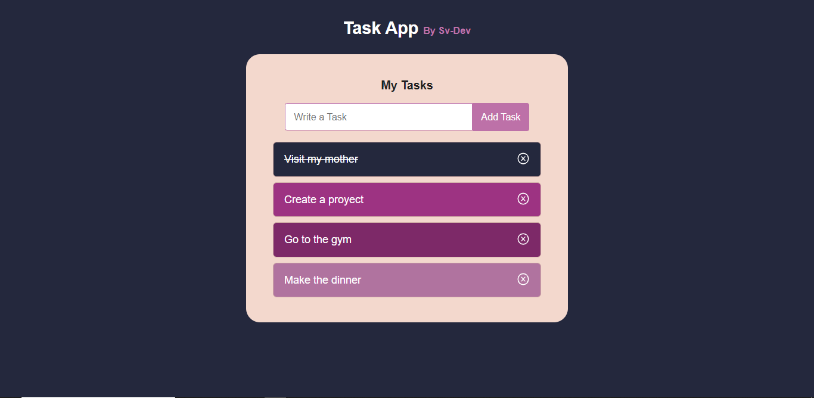

Hello friends, it's a pleasure to share with you a project I created some time ago. It was one of my first projects using create-react-app.

# Task App

Task App is an application for managing your daily tasks.

- **Task Management:** Easily create, mark as completed, and delete tasks.

### Screenshot

## Available Scripts

In the project directory, you can run:

### `npm start`

Runs the app in the development mode.\
Open [http://localhost:3000](http://localhost:3000) to view it in your browser.

The page will reload when you make changes.\
You may also see any lint errors in the console.

